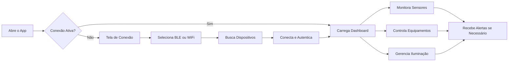

# 🚐 Motorhome Manager: Apresentação e Funcionalidades

> **Repositório Oficial:** [github.com/FabinhoEdinei/motorhome-manager](https://github.com/FabinhoEdinei/motorhome-manager)  
> *Parte 1 de 3 da série completa sobre o Motorhome Manager*

Desenvolvi o **Motorhome Manager** com um propósito claro: transformar a experiência de viajar em motorhome em algo mais seguro, eficiente e conectado. Este app mobile open source permite monitorar e controlar todos os sistemas essenciais do veículo diretamente do seu smartphone.

---

## 🎯 O Que É o Motorhome Manager?

O **Motorhome Manager** é um aplicativo mobile desenvolvido em **React Native + Expo** que funciona como um **painel de controle centralizado** para motorhomes. Ele se conecta via **Bluetooth Low Energy (BLE)** ou **WiFi** aos sensores e atuadores do veículo, proporcionando:

- 📊 Monitoramento em tempo real de sensores
- 💡 Controle remoto de iluminação por zonas
- 🔌 Gerenciamento de equipamentos elétricos
- ⚠️ Sistema de alertas inteligentes
- ⚙️ Configurações personalizadas de automação

> ✨ **Próximo da série:** Na Parte 2, exploraremos a stack tecnológica, estrutura do projeto e como integrar com hardware real (Arduino/ESP32).

---

## ✨ Funcionalidades Principais

### 📈 Dashboard em Tempo Real

Visualize métricas críticas do seu motorhome em cards intuitivos:

| Sensor | O Que Monitora | Por Que É Importante |
|--------|---------------|---------------------|
| 🔋 Bateria | Nível de carga (%) | Evita ficar sem energia no meio do nada |
| 💧 Nível de Água | Tanque de água limpa/esgoto | Planeja reabastecimento e descarte |
| ☀️ Energia Solar | Geração em watts | Otimiza consumo e recarga |
| 🌡️ Temperatura | Interna/externa | Conforto térmico e prevenção de danos |
| ⚖️ Balanço Energético | Entrada vs. saída | Gestão inteligente de energia |

Cada card exibe:
- ✅ Valor atual com unidade de medida
- 📊 Barra de progresso visual com cores dinâmicas
- 🔄 Ícone de atualização manual
- ⏱️ Timestamp da última leitura

### 🔌 Controle de Equipamentos por Categoria

Liga/desliga dispositivos com um toque, organizados por categorias intuitivas:Cada equipamento exibe:
- ✅ Status visual (ligado/desligado) com animação de toggle
- 📊 Consumo estimado em watts
- 🎨 Feedback tátil e sonoro opcional
- 🕐 Temporizador para desligamento automático

### 💡 Iluminação Inteligente em 6 Zonas

Controle granular da iluminação do motorhome com interface visual:> ✨ *Interface com animações fluidas usando `react-native-reanimated` para transições suaves entre níveis de brilho.*

### ⚠️ Sistema de Alertas & Testes Automáticos

Mantenha-se informado proativamente com um sistema inteligente de notificações:

#### Tipos de Alertas:
- 🔴 **Críticos**: Bateria <15%, vazamento detectado, sobrecarga elétrica
- 🟡 **Preventivos**: Manutenção programada, filtros para troca, baixa pressão de água
- 🔵 **Informativos**: Conexão estabelecida, atualização concluída, modo economia ativado

#### Recursos Avançados:
- 🧪 **Testes de Circuito**: Verificação automática de sensores com intervalos configuráveis (5min/15min/1h)
- 📋 **Histórico de Eventos**: Log completo com timestamp para diagnóstico de problemas
- 🔔 **Notificações Push**: Alertas mesmo com o app em background ou tela bloqueada

### ⚙️ Configurações Avançadas

Personalize sua experiência com opções flexíveis:

- 📡 **Conexão**: Gerenciamento de dispositivos Bluetooth/WiFi pareados
- 🎚️ **Limites Personalizados**: Defina thresholds para alertas (ex: alertar bateria em 30% ao invés de 20%)
- 🤖 **Automações Simples**: Regras básicas como "ligar luz externa ao escurecer" ou "desligar geladeira se bateria <10%"
- 🎨 **Preferências**: Tema (claro/escuro/automático), idioma, sons de notificação, unidades de medida

---

## 🎨 Design & Experiência do Usuário

### Princípios de UI Aplicados:

1. **Hierarquia Visual Clara**: Métricas críticas em destaque com tipografia escalonada
2. **Feedback Imediato**: Animações confirmam ações do usuário em <100ms
3. **Acessibilidade**: Contraste WCAG AA, suporte a VoiceOver/TalkBack, tamanhos de fonte dinâmicos
4. **Modo Noturno Nativo**: Cores escuras (#0A0E17 de fundo, #00E5C5 de acento) reduzem cansaço visual em viagens noturnas

### Interações Especiais:### Paleta de Cores & Tipografia:

```yaml
Cores Principais:
  fundo: "#0A0E17"        # Azul escuro profundo
  superfície: "#151E2E"   # Azul acinzentado
  acento: "#00E5C5"       # Teal vibrante para ações
  sucesso: "#4CAF50"      # Verde para status OK
  alerta: "#FF9800"       # Laranja para warnings
  crítico: "#F44336"      # Vermelho para erros

Tipografia:
  títulos: "Inter SemiBold"
  corpo: "Inter Regular"
  monoespaçado: "JetBrains Mono" (para valores técnicos)
```

---

## 📱 Fluxo Principal do Usuário



> 💡 **Dica de UX**: O app inclui **modo de simulação** que gera dados fictícios dos sensores, permitindo testar todas as funcionalidades sem hardware real conectado.

---

## 🔗 Navegação da Série Completa

| Parte | Título | Link |
|-------|--------|------|
| **1** | ✅ Apresentação e Funcionalidades | *Você está aqui* |
| **2** | 🔧 Aspectos Técnicos e Implementação | [motorhome-manager-tecnico](/motorhome-manager-tecnico) |
| **3** | 🚀 Roadmap, Melhorias e Como Contribuir | [motorhome-manager-roadmap](/motorhome-manager-roadmap) |

---

> 🚐 *"Viajar é viver. E viver com tecnologia inteligente é viajar com mais liberdade."*

**Motorhome Manager** — Seu companheiro digital para aventuras sobre rodas.

---

*Última atualização: Março 2026*  
*Versão do App: 0.1.0 (Alpha)*  
*Licença: MIT*  
*Série: Motorhome Manager (1/3)*