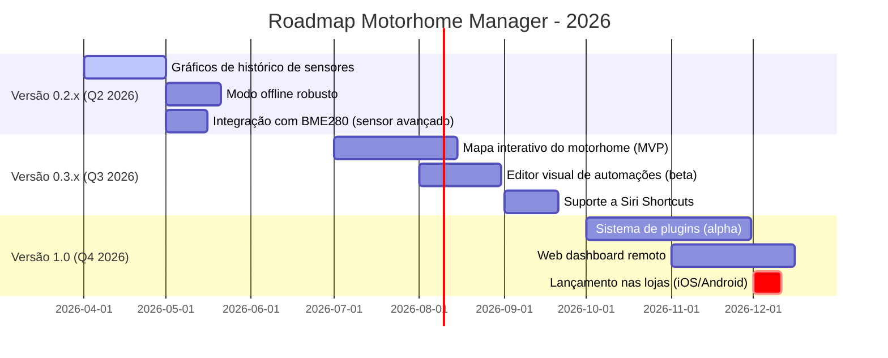

# 🚀 Motorhome Manager: Roadmap, Melhorias Futuras e Como Contribuir

> **Repositório Oficial:** [github.com/FabinhoEdinei/motorhome-manager](https://github.com/FabinhoEdinei/motorhome-manager)  
> *Parte 3 de 3 da série completa sobre o Motorhome Manager*

Nesta parte final da série, exploramos o futuro do Motorhome Manager: funcionalidades planejadas, ideias de melhoria baseadas em feedback real da comunidade e um guia completo para você contribuir com o projeto.

> ✨ **Leitura recomendada:** Comece pela [Parte 1: Apresentação](/motorhome-manager-apresentacao-funcionalidades) e [Parte 2: Técnico](/motorhome-manager-tecnico-implementacao) para entender o contexto completo.

---

## 💡 Ideias para Melhorias Futuras (Roadmap)

Baseado na arquitetura atual, feedback de usuários e necessidades reais de viajantes, aqui estão as funcionalidades planejadas para evolução do projeto:

### 🚀 Funcionalidades de Alto Impacto (Prioridade Máxima)

#### 1. **Mapa Interativo do Motorhome** 🗺️### 🔧 Melhorias Técnicas (Prioridade Alta)

#### 4. **Sincronização em Nuvem Opcional** ☁️
- Backup criptografado de configurações e histórico de alertas
- Acesso remoto via web dashboard (React + Firebase/Supabase)
- Compartilhamento seguro de configurações entre múltiplos motorhomes da mesma família
- Sincronização diferencial para economizar dados móveis

#### 5. **Integração com Assistentes de Voz** 🗣️
- Comandos por voz nativos: "Ok Google, ligar luz da cozinha" ou "Siri, qual o nível da bateria?"
- Suporte a Siri Shortcuts (iOS) e Alexa Skills (via cloud function)
- Feedback por voz para alertas críticos (útil com as mãos ocupadas)
- Modo "Sussurro": respostas em volume baixo para não perturbar à noite

#### 6. **Modo Offline Robusto** 📴
- Cache inteligente dos últimos 24h de dados dos sensores
- Fila de comandos para execução automática quando conexão retornar
- Sincronização diferencial com resolução de conflitos (last-write-wins ou merge inteligente)
- Indicador visual claro do status de conectividade

#### 7. **Sistema de Plugins/Extensões** 🔌
- API pública para desenvolvedores criarem módulos personalizados
- Marketplace integrado de plugins: integração com apps de roteiro (Roadtrippers), estações meteorológicas (OpenWeather), etc.
- Sandboxing de plugins para segurança: permissões explícitas para acesso a sensores/comandos
- Sistema de avaliações e curadoria comunitária

### 🎨 Experiência do Usuário (Prioridade Média)

#### 8. **Personalização Avançada de Dashboard** 🎨
- Widgets arrastáveis, redimensionáveis e empilháveis
- Temas personalizados além do dark mode: "Solar Focus", "Minimalista", "Alto Contraste"
- Perfis de usuário com configurações específicas: "Condutor", "Passageiro", "Manutenção", "Visitante"
- Exportação/importação de layouts para compartilhar com a comunidade

#### 9. **Tutorial Interativo de Primeiros Passos** 🎓
- Onboarding guiado com animações e micro-interactions
- Modo "Simulação Avançada": cenários pré-configurados para treinar (ex: "Bateria crítica à noite")
- Dicas contextuais que aparecem no momento certo (ex: ao conectar hardware pela primeira vez)
- Quiz de verificação de aprendizado com recompensas visuais

#### 10. **Comunidade & Compartilhamento** 👥
- Fórum integrado para troca de configurações, dúvidas e soluções
- Sistema de "receitas" compartilháveis de automação com versionamento
- Ranking opcional de eficiência energética entre usuários (gamificação saudável)
- Eventos comunitários: "Desafio de Economia de Energia", "Melhor Configuração de Iluminação"

---

## 📊 Roadmap Visual (Timeline Planejada)



> 📌 **Nota:** Datas são estimativas e podem ajustar conforme feedback da comunidade e disponibilidade de contribuidores.

---

## 🤝 Como Contribuir com o Projeto

O Motorhome Manager é **open source** e construído com a filosofia "community-first". Sua contribuição é bem-vinda, independente do seu nível de experiência!

### 🚀 Passos para Contribuir (Guia Rápido)

```markdown
1. **Fork** o repositório em github.com/FabinhoEdinei/motorhome-manager

2. **Clone** seu fork localmente:
   git clone https://github.com/SEU_USUARIO/motorhome-manager.git
   cd motorhome-manager

3. **Crie uma branch** para sua feature/fix:
   git checkout -b feature/minha-ideia-incrivel
   # ou
   git checkout -b fix/correcao-importante

4. **Desenvolva e teste** localmente:
   pnpm install
   pnpm dev  # Teste no Expo Go
   pnpm test # Execute testes automatizados

5. **Commit** com mensagens claras e semânticas:
   git commit -m "feat: adiciona gráfico de bateria com histórico 24h"
   git commit -m "fix: corrige vazamento de memória no scanner BLE"
   git commit -m "docs: atualiza README com instruções de hardware"

6. **Push** e abra um **Pull Request**:
   git push origin feature/minha-ideia-incrivel
   # Acesse GitHub e clique em "New Pull Request"

7. **Participe da revisão**: Responda comentários, ajuste código conforme feedback
```

### 🎯 Áreas que Precisam de Ajuda (Good First Issues)

| Categoria | Tarefa | Dificuldade | Tags |
|-----------|--------|-------------|------|
| 🔌 Hardware | Documentar pinagem ESP32 para INA219 | 🟢 Iniciante | `hardware`, `docs`, `good first issue` |
| 🌐 i18n | Traduzir interface para Espanhol | 🟢 Iniciante | `i18n`, `translation`, `good first issue` |
| 🧪 Testes | Adicionar testes para componente LightZoneCard | 🟡 Intermediário | `tests`, `react-testing-library` |
| 🎨 UI | Criar ícones SVG para novas categorias de equipamentos | 🟡 Intermediário | `design`, `svg`, `ui` |
| 🔧 BLE | Implementar reconexão automática em dispositivos BLE | 🔴 Avançado | `ble`, `connection`, `bug` |
| 🤖 Automação | Prototipar interface do editor visual de regras | 🔴 Avançado | `automation`, `prototype`, `ux` |

> 💡 **Dica:** Procure por issues marcadas com `good first issue` no GitHub para começar com algo gerenciável.

### 📋 Diretrizes de Contribuição

#### Código:
- Siga o ESLint config do projeto (`pnpm lint` antes de commitar)
- Escreva TypeScript estrito: evite `any`, use tipos explícitos
- Componentes: máximo de 200 linhas; extraia subcomponentes se necessário
- Testes: nova feature = novos testes; bugfix = teste que reproduz o bug

#### Documentação:
- Atualize README.md se mudar comportamento público
- Documente props de componentes com JSDoc
- Inclua exemplos de uso em comentários para funções complexas

#### Commits:
- Use [Conventional Commits](https://www.conventionalcommits.org/):
  - `feat:` para novas funcionalidades
  - `fix:` para correções de bugs
  - `docs:`, `style:`, `refactor:`, `test:`, `chore:` para demais mudanças
- Mantenha commits atômicos: uma mudança lógica por commit

#### Pull Requests:
- Título descritivo: "Adiciona gráfico de histórico de bateria"
- Descrição com:
  - ✅ O que foi feito
  - 🎯 Por que foi feito
  - 🧪 Como testar
  - 📸 Screenshots (para mudanças visuais)
- Link para issue relacionada (se houver): `Closes #123`

---

## 📱 Screenshots Conceituais (Roadmap)

> *Ilustrações das funcionalidades planejadas*

### 🗺️ Mapa Interativo (Conceito)---

## 🙏 Agradecimentos Especiais

- 👥 **Comunidade Expo & React Native**: Pelas ferramentas que tornam o desenvolvimento mobile acessível
- 🚐 **Entusiastas de Motorhome**: Pelos feedbacks reais que moldaram as funcionalidades
- 💻 **Contribuidores Open Source**: Por cada PR, issue reportada e ideia compartilhada
- 🛠️ **Fabricantes de Hardware**: Por documentação clara que facilita a integração

---

## 📬 Contato, Suporte e Comunidade

### 🐛 Reportar Bugs ou Sugerir Features:
- **GitHub Issues**: [github.com/FabinhoEdinei/motorhome-manager/issues](https://github.com/FabinhoEdinei/motorhome-manager/issues)
- Use templates: `Bug Report`, `Feature Request`, `Question`

### 💬 Comunidade & Discussões:
- **GitHub Discussions**: Para ideias, dúvidas e compartilhamento de configurações
- **Discord (em breve)**: Canal para suporte em tempo real e networking entre usuários
- **Fórum Motorhome Brasil**: Tópico dedicado para usuários do app

### 🐦 Redes Sociais do Projeto:
- **Twitter/X**: [@FabinhoEdinei](https://twitter.com/FabinhoEdinei) - Atualizações e dicas
- **Instagram**: [@motorhome.manager](https://instagram.com/motorhome.manager) - Screenshots e cases
- **YouTube (em breve)**: Tutoriais em vídeo e demos de funcionalidades

### ✉️ Contato Direto:
- **Email**: fabio.edinei@exemplo.com *(substitua pelo seu email real)*
- **LinkedIn**: [linkedin.com/in/fabioedinei](https://linkedin.com/in/fabioedinei)

---

## 📚 Recursos Adicionais

### Para Desenvolvedores:
- [Documentação do Expo](https://docs.expo.dev/)
- [React Native Directory](https://reactnative.directory/) - Bibliotecas recomendadas
- [ESP32 Arduino Core](https://github.com/espressif/arduino-esp32) - Firmware reference

### Para Usuários Finais:
- [Guia de Instalação de Hardware](https://github.com/FabinhoEdinei/motorhome-manager/wiki/Hardware-Guide) *(wiki em construção)*
- [FAQ: Perguntas Frequentes](https://github.com/FabinhoEdinei/motorhome-manager/wiki/FAQ)
- [Vídeos Tutoriais](https://youtube.com/playlist?list=...) *(playlist em breve)*

### Para Contribuidores:
- [Guia de Contribuição Detalhado](https://github.com/FabinhoEdinei/motorhome-manager/blob/main/CONTRIBUTING.md)
- [Código de Conduta](https://github.com/FabinhoEdinei/motorhome-manager/blob/main/CODE_OF_CONDUCT.md)
- [Roadmap Público](https://github.com/orgs/FabinhoEdinei/projects/1) - Acompanhe o progresso

---

## ✅ Conclusão da Série

O **Motorhome Manager** nasceu de uma necessidade real: ter controle inteligente, confiável e acessível sobre os sistemas do motorhome. Com:

1. ✅ **Funcionalidades práticas** que resolvem problemas do dia a dia
2. 🔧 **Arquitetura técnica sólida** preparada para escalar
3. 🚀 **Roadmap ambicioso** alinhado com necessidades reais da comunidade
4. 🤝 **Cultura open source** que convida todos a participar

...este projeto está pronto para evoluir com você.

> 🚐 *"Viajar é viver. E viver com tecnologia inteligente é viajar com mais liberdade, segurança e consciência."*

**Motorhome Manager** — Seu companheiro digital para aventuras sobre rodas.  
**Open Source. Feito com ❤️. Para a comunidade.**

---

## 🔗 Navegação da Série Completa

| Parte | Título | Link |
|-------|--------|------|
| **1** | 🚐 Apresentação e Funcionalidades | [motorhome-manager-apresentacao](/motorhome-manager-apresentacao-funcionalidades) |
| **2** | 🔧 Aspectos Técnicos e Implementação | [motorhome-manager-tecnico](/motorhome-manager-tecnico-implementacao) |
| **3** | ✅ Roadmap, Melhorias e Como Contribuir | *Você está aqui* |

---

*Última atualização: Março 2026*  
*Versão do App: 0.1.0 (Alpha)*  
*Licença: MIT*  
*Série: Motorhome Manager (3/3)*  
*Repositório: [github.com/FabinhoEdinei/motorhome-manager](https://github.com/FabinhoEdinei/motorhome-manager)*