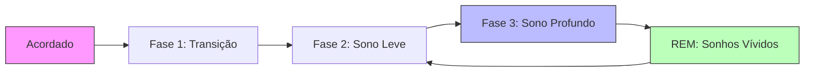

# 😴 O Sono e os Sonhos: A Ciência do Descanso e os Mistérios da Mente Noturna

> *"O sono é a melhor meditação."* — Dalai Lama

Dormir não é apenas "desligar" o corpo. É um processo ativo, complexo e essencial que regenera células, consolida memórias, processa emoções e prepara a mente para o dia seguinte. E os sonhos? São muito mais que histórias aleatórias: são janelas para nosso inconsciente, laboratórios emocionais e possíveis guias para o autoconhecimento.

Neste artigo, exploramos:
- 🧠 A ciência por trás do sono e suas fases
- 💤 Como construir uma rotina para dormir melhor
- 🌙 O que são os sonhos e por que sonhamos
- 🔍 Como interpretar (ou não) seus sonhos
- ✨ Práticas para integrar sono e sonhos em uma vida mais plena

---

## 🧬 A Ciência do Sono: O Que Acontece Quando Dormimos

### As 4 Fases do Ciclo do Sono

O sono não é uniforme. Ele se organiza em ciclos de ~90 minutos, repetidos 4-6 vezes por noite:



| Fase | Nome Técnico | Duração | O Que Acontece | Importância |
|------|-------------|---------|---------------|-------------|
| **1** | N1 (Transição) | 1-7 min | Relaxamento muscular, ondas cerebrais desaceleram | Transição suave para o sono |
| **2** | N2 (Sono Leve) | 10-25 min | Temperatura corporal cai, frequência cardíaca diminui | Consolidação de memória procedural |
| **3** | N3 (Sono Profundo) | 20-40 min | Ondas delta lentas, liberação de GH, reparo tecidual | Restauração física, imunidade, crescimento |
| **4** | REM | 10-60 min | Atividade cerebral intensa, olhos se movem, músculos paralisados | Processamento emocional, criatividade, memória |

> 📊 **Curiosidade**: Passamos ~25% da noite em REM. Bebês chegam a 50%! Isso sugere que sonhar é crucial para o desenvolvimento cerebral.

### O Relógio Biológico: Ritmo Circadiano

Seu corpo segue um ciclo de ~24 horas regulado pelo **núcleo supraquiasmático** no hipotálamo:**Fatores que desregulam o ritmo circadiano:**
- ❌ Luz azul de telas após o pôr do sol
- ❌ Jet lag e turnos noturnos
- ❌ Alimentação tardia e cafeína após 14h
- ❌ Estresse crônico e ansiedade

---

## 💤 Como Dormir Melhor: Higiene do Sono na Prática

### 🏆 Os 10 Pilares da Higiene do Sono

```yaml
1. Ambiente:
   • Quarto escuro, silencioso e fresco (18-22°C)
   • Colchão e travesseiro adequados à sua postura
   • Reserve a cama apenas para sono e intimidade

2. Rotina:
   • Horários regulares para dormir e acordar (±30 min)
   • Ritual pré-sono de 30-60 min: leitura, meditação, alongamento
   • Evite sonecas >20 min ou após 15h

3. Alimentação:
   • Jantar leve 2-3h antes de dormir
   • Evite cafeína após 14h e álcool próximo ao sono
   • Chás calmantes: camomila, erva-cidreira, maracujá

4. Tecnologia:
   • Sem telas 1h antes de dormir (ou use filtro de luz azul)
   • Modo "Não Perturbe" ativado durante a noite
   • Carregue o celular fora do quarto

5. Movimento:
   • Exercício regular (mas não 3h antes de dormir)
   • Alongamentos ou yoga suave à noite
   • Exposição à luz natural pela manhã

6. Mente:
   • Journaling para "esvaziar" preocupações antes de dormir
   • Técnicas de respiração: 4-7-8 ou box breathing
   • Meditação guiada para sono (apps: Calm, Insight Timer)

7. Conforto:
   • Roupas de cama respiráveis (algodão, linho)
   • Pijamas confortáveis e não restritivos
   • Máscara de dormir e protetores auriculares se necessário

8. Hidratação:
   • Beba água ao longo do dia, mas reduza 2h antes de dormir
   • Evite diuréticos (café, chá preto, álcool) à noite

9. Consistência:
   • Mantenha a rotina mesmo nos finais de semana
   • Se não dormir em 20 min, levante e faça algo calmo até sentir sono

10. Paciência:
    • Melhorar o sono leva semanas, não noites
    • Celebre pequenos progressos
    • Busque ajuda profissional se a insônia persistir >3 semanas
```

### 🚫 Erros Comuns que Prejudicam o Sono

| Erro | Por Que Prejudica | Alternativa |
|------|----------------|-------------|
| 📱 Rolar redes sociais na cama | Luz azul suprime melatonina; conteúdo estimula ansiedade | Leia livro físico ou ouça podcast calmo |
| 🍷 "Uma taça para relaxar" | Álculo fragmenta o sono e reduz REM | Chá de camomila ou água com limão |
| ⏰ Soneca longa à tarde | Reduz pressão de sono noturna | Soneca de 10-20 min antes das 15h |
| 🍽️ Jantar pesado tarde da noite | Digestão ativa compete com o sono | Jantar leve até 3h antes de dormir |
| 🧠 Ficar na cama preocupado | Cria associação cama = ansiedade | Levante, faça algo monótono, volte com sono |

---

## 🌙 Os Sonhos: Por Que Sonhamos e O Que Significam?

### Teorias Científicas Sobre a Função dos Sonhos

A ciência ainda debate, mas as principais hipóteses são:

#### 1. **Processamento Emocional** 🧠
- Durante o REM, o cérebro reprocessa experiências emocionais do dia
- A amígdala (centro do medo) está ativa, mas sem noradrenalina → permite "revisitar" emoções com segurança
- Sonhos recorrentes podem indicar emoções não resolvidas

#### 2. **Consolidação de Memória** 📚
- O sono REM ajuda a integrar novas informações com memórias existentes
- Sonhos podem ser "simulações" que fortalecem conexões neurais
- Estudos mostram: quem sonha mais com uma tarefa aprendida tem melhor performance no dia seguinte

#### 3. **Criatividade e Solução de Problemas** 💡
- A mente onírica faz conexões improváveis → insights criativos
- Exemplos históricos: estrutura do benzeno (Kekulé), máquina de costura (Howe), teoria da relatividade (Einstein relatou sonhos relacionados)

#### 4. **Teoria da Simulação de Ameaças** 🛡️
- Sonhos seriam "treinos" evolutivos para lidar com perigos
- Explica por que sonhos de perseguição, queda ou confronto são universais

#### 5. **Manutenção Neural** 🔄
- Sonhar poderia ser um "efeito colateral" da limpeza de toxinas e reorganização sináptica durante o sono

### 🗂️ Tipos Comuns de Sonhos e Possíveis Significados

> ⚠️ **Importante**: Interpretações são simbólicas, não literais. Contexto pessoal é essencial.

| Tema do Sonho | Possíveis Significados Simbólicos | Pergunta para Reflexão |
|--------------|----------------------------------|----------------------|
| **Voar** | Liberdade, superação, nova perspectiva | O que me faz sentir leve e sem limites? |
| **Cair** | Medo de perder controle, insegurança | Onde estou me sentindo instável na vida? |
| **Ser perseguido** | Evitar emoções ou responsabilidades | O que estou evitando enfrentar? |
| **Dentes caindo** | Ansiedade sobre imagem, comunicação ou mudança | O que estou com medo de perder ou expressar? |
| **Estar nu em público** | Vulnerabilidade, medo de julgamento | Onde me sinto exposto ou inadequado? |
| **Prova/Exame** | Pressão por desempenho, autoexigência | Estou me cobrando além do razoável? |
| **Casa com cômodos desconhecidos** | Partes de si mesmo ainda não exploradas | Que aspecto meu merece mais atenção? |
| **Água (calma ou turbulenta)** | Estado emocional: paz ou caos interior | Como estou me sentindo emocionalmente? |
| **Pessoas falecidas** | Processamento de luto, busca por orientação | O que essa pessoa representa para mim hoje? |
| **Sonhos lúcidos** | Consciência expandida, desejo de controle | Onde quero mais autonomia na minha vida? |

### 🔍 Como Trabalhar com Seus Sonhos (Sem Misticismo)

#### Método Prático de Registro e Reflexão:

```markdown
1. **Tenha um diário de sonhos à mão**
   - Caderno físico ou app (Day One, DreamKit)
   - Anote assim que acordar, antes de levantar

2. **Registre o básico:**
   - Data e horário
   - Emoção predominante ao acordar
   - Personagens, cenários, ações principais
   - Detalhes sensoriais (cores, sons, texturas)

3. **Faça 3 perguntas reflexivas:**
   • O que esse sonho me faz sentir HOJE?
   • Há alguma situação atual que ecoa esse símbolo?
   • Se esse sonho fosse um conselho, o que diria?

4. **Evite interpretações rígidas:**
   - Sonhos são pessoais: "cobra" pode ser medo para um, cura para outro
   - Foque em padrões recorrentes, não em sonhos isolados
   - Use símbolos como pontos de partida, não respostas finais

5. **Integre insights na vida desperta:**
   - Sonhou com viagem travada? Que pequeno passo posso dar hoje?
   - Sonhou com conversa difícil? Posso preparar essa conversa?
   - Sonhou com leveza? Como trazer mais leveza à minha rotina?
```

#### 🎨 Técnicas para Lembrar Mais Sonhos:

- 🛏️ **Intenção pré-sono**: Ao deitar, repita mentalmente: "Vou lembrar dos meus sonhos"
- 🔄 **Despertar suave**: Evite alarmes bruscos; use luz gradual ou vibração
- 🧘 **Minutos de quietude**: Ao acordar, fique imóvel e revise mentalmente antes de anotar
- 🚫 **Sem telas imediatas**: A luz e estímulos apagam memórias oníricas frágeis
- 📓 **Consistência**: Registrar diariamente treina o cérebro a reter mais

---

## 🌿 Sono, Sonhos e Desenvolvimento Pessoal

### A Conexão com Seus Outros Interesses

Lembrando que você busca funcionalidades que permitam:
- ✅ **Acompanhamento temporal**: Assim como monitora treinos, pode rastrear padrões de sono
- ✅ **Marcação de início/meio/fim**: Registre quando dorme, quando sonha, quando acorda
- ✅ **Interface interativa**: Imagine um "mapa do sono" com emojis representando fases e sonhos
- ✅ **Visualização de dados**: Gráficos de qualidade do sono ao longo do tempo

#### 💡 Ideia de Funcionalidade Futura:### Sono como Base para Performance

Se você trabalha com periodização de força ou esportes, saiba que:> 🏋️ **Dica para atletas**: Priorize 7-9h de sono como parte do treino. Uma noite mal dormida equivale a perder ~30% da performance cognitiva no dia seguinte.

---

## 🧭 Quando Buscar Ajuda Profissional

### Sinais de que seu sono merece atenção médica:### Profissionais que Podem Ajudar:

| Especialista | Quando Procurar | O Que Faz |
|-------------|----------------|-----------|
| **Médico do Sono** | Suspeita de apneia, narcolepsia, distúrbios motores | Exames como polissonografia, tratamento médico |
| **Psicólogo/Terapeuta** | Insônia relacionada a ansiedade, trauma, estresse | TCC-I (Terapia Cognitivo-Comportamental para Insônia), processamento emocional |
| **Nutricionista** | Sono afetado por alimentação, refluxo, deficiências | Ajustes na dieta, suplementação (melatonina, magnésio) se indicado |
| **Fisioterapeuta** | Dores que atrapalham o sono, postura inadequada | Exercícios, ajustes ergonômicos, técnicas de relaxamento |

---

## ✨ Ritual Noturno Sugerido (60 Minutos)> 🌟 **Lembrete**: O objetivo não é "dormir perfeito", mas criar condições para que o sono aconteça naturalmente. Alguns dias serão melhores que outros — e tudo bem.

---

## 📚 Recursos Recomendados

### Livros:
- *"Por Que Dormimos"* — Matthew Walker (ciência acessível e transformadora)
- *"A Interpretação dos Sonhos"* — Sigmund Freud (clássico, leia com olhar crítico)
- *"O Poder do Sono"* — Nick Littlehales (abordagem prática para performance)

### Apps:
- **Sleep Cycle**: Analisa padrões de sono via microfone/acelerômetro
- **Insight Timer**: Meditações guiadas para sono e ansiedade
- **DreamKit**: Diário de sonhos com tags e busca por símbolos
- **f.lux / Night Shift**: Filtro de luz azul automático em dispositivos

### Canais e Conteúdo:
- **YouTube**: Dr. Matthew Walker (entrevistas), Huberman Lab (episódios sobre sono)
- **Podcasts**: "Sono e Neurociência" (USP), "The Sleep Council" (UK)
- **Comunidades**: Reddit r/sleep, r/dreams (com moderação e senso crítico)

---

## 🌅 Conclusão: Dormir Bem é Viver Melhor

O sono não é tempo perdido. É investimento.

Cada noite de descanso profundo:
- 🧠 Reconecta sua mente
- 💪 Reconstrói seu corpo
- ❤️ Reequilibra suas emoções
- ✨ Reabre espaço para criatividade e clareza

E os sonhos? São presentes noturnos — às vezes confusos, às vezes reveladores, sempre pessoais. Não precisamos decifrá-los todos. Basta estar abertos a escutar o que têm a dizer.

> 🌙 *"Cuide do seu sono como cuida dos seus treinos, dos seus projetos, dos seus relacionamentos. Porque é no descanso que a vida se renova."*

---

**📌 Fontes Consultadas:**
- Walker, M. (2017). *Why We Sleep*. Scribner.
- American Academy of Sleep Medicine. (2023). *International Classification of Sleep Disorders*.
- National Sleep Foundation. (2025). *Sleep Hygiene Guidelines*.
- Domhoff, G. W. (2022). *The Scientific Study of Dreams*. APA.
- Estudos revisados por pares sobre sono, REM e consolidação de memória (PubMed, 2020-2026).

---

*Última atualização: Março 2026*  
*Autor: Fabio Edinei*  
*Categoria: Bem-Estar*  
*Tempo de leitura: ~12 minutos*